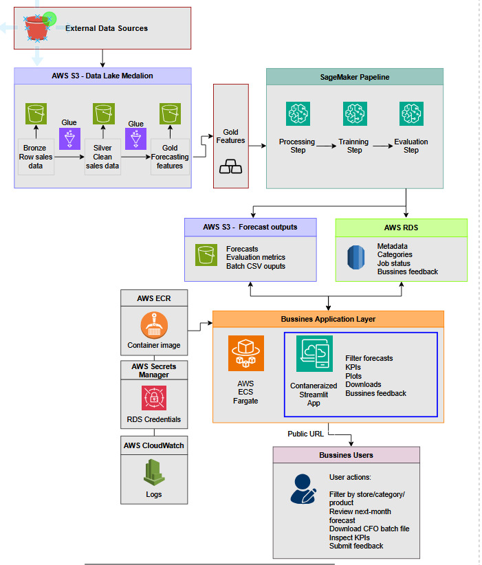
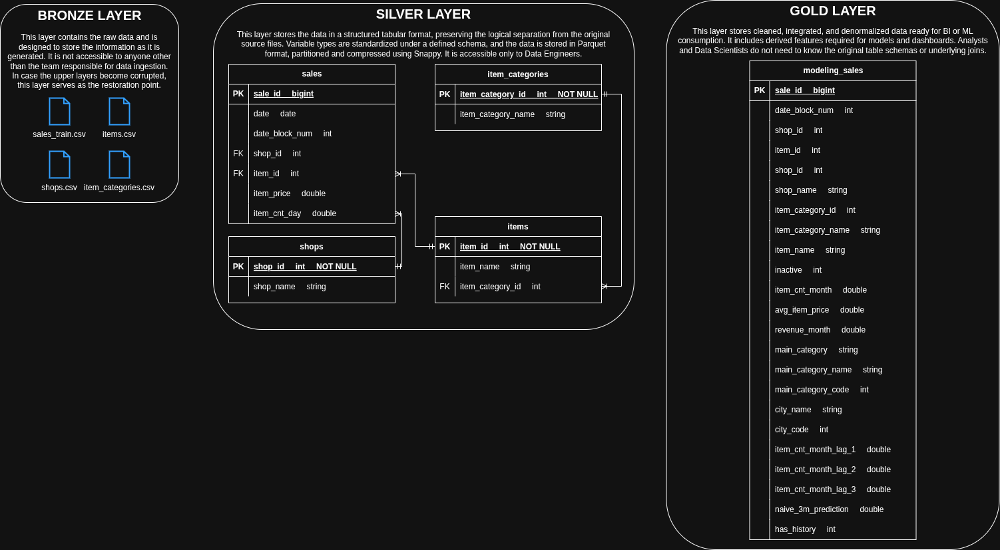

# 1. Introducción

## 1.1. Descripción del problema de negocio

La compañía 1C Company cuenta con una amplia gama de productos y una red de puntos de venta que requieren de un alto nivel de planeación para estimar la demanda futura y así garantizar el abastecimiento de sus tiendas, tomar decisiones financieras y generar estrategias de ventas, como promociones y activaciones en punto de venta.

Actualmente, el acceso a los datos históricos de las ventas y la generación de forecasts mensuales no están automatizados, lo que genera dependencia de procesos manuales para la generación de reportes, los archivos para el área financiera y en el análisis exploratorio por parte de los equipos operativos.

Además, los distintos equipos (Planeación, Finanzas y Operaciones) requieren autonomía para consultar y analizar la información con distintos niveles de agregación (producto, categoría, tienda, región y canal), sin depender directamente de equipos técnicos.

Por lo anterior, existe la necesidad de construir una solución que permita:

- Centralizar los datos de ventas y pronósticos.
- Reducir la dependencia de procesos manuales.
- Facilitar el acceso a la información mediante una interfaz accesible.


## 1.2 Objetivo

Construir el MVP de un producto de datos enteramente contenido en la nube que, a través de una interfás de usuario, permita a los equipos de Planeación, Finanzas y Operaciones, así como personal Directivo, acceder a los datos de ventas y forecasts con horizontes de un mes y distintos niveles de agregación: producto, categoría, tienda, región y canal, desde cualquier equipo de cómputo en la empresa, en cualquier momento, a un costo bajo.

El producto deberá permitir:

- **La exploración interactiva:**
Los usuarios podrán filtrar la información por distintos niveles de agregación (producto, categoría, tienda, región y canal) y visualizar los pronósticos junto con métricas clave de desempeño.
- **La generación de reprtes para negocio:**
Permitir la descarga bajo demanda de archivos con pronósticos agregados (por ejemplo, a nivel categoría o catálogo completo), los cuales estarán almacenados en una ubicación accesible.
- **El consumo analítico:**
Facilitar el acceso a los datos de pronósticos y métricas para su uso en análisis adicionales por parte de equipos de BI.

Adicionalmente, el MVP deberá:

- Contar con un mecanismo para capturar retroalimentación del negocio sobre productos o categorías con fallas o comportamientos atípicos.
- Garantizar tiempos de respuesta adecuados en la exploración interactiva (segundos).
- Mantener un costo de operación acotado, de manera que sea competitivo frente a los procesos manuales actuales.


# 2. Solución propuesta

Con la finalidad de atender las necesidades del cliente, se propone desarrollar una aplicación de Streamlit desplegada en AWS con una URL pública accesible desde cualquier navegador en equipos de cómputo de la 1C Company. Esta aplicación permite separar en capas el almacenamiento de datos, el procesamiento analítico y la capa de consumo, lo que facilita su escalabilidad y mantenibilidad, al tiempo que mantiene su disponibilidad.

**Link a la solución:** [Demand Forecasting App](http://98.84.41.174:8501)


## 2.1 Arquitectura




## 2.2 Capa de datos

Los datos de ventas históricas (entrenamiento) se consumen desde una ubicación indicada por el cliente mediante su API (en este ejemplo se extraen de Kaggle) mediante acceso autenticado, gestionado a través de **AWS Secrets Manager**. Una vez ingeridos, se almacenan en **Amazon S3**.

Para esta capa se implementa un proceso ELT bajo el enfoque medallion (Bronze, Silver, Gold):

- *Bronze:* Datos crudos de ventas en formato CSV.
- *Silver:* Tablas con tipos de datos unificados y particionados en formato Parquet.
- *Gold:* Tablas analíticas y features utilizadas para entrenamiento e inferencia.

El catálogo de datos se gestiona mediante **AWS Glue Data Catalog**.

### ERD




## 2.3 Capa de Machine Learning

El entrenamiento y evaluación del modelo se realiza mediante **Amazon SageMaker**, incluyendo:

- Procesamiento de datos
- Entrenamiento del modelo
- Evaluación con métricas de desempeño

Las métricas generadas se almacenan en **Amazon S3**, y el modelo seleccionado se registra en **SageMaker Model Registry** para su versionamiento y futura reutilización.

A partir del modelo entrenado, se generan predicciones de demanda que se almacenan en **S3** como tablas de consumo.

- Para este MVP se optó por un esquema de pronósticos pre-computados offline al inicio del periodo. Este esquema permite ahorrar costos pues sólo se corre una vez al mes a través de un Notebook programado de manera mensual (**Pipeline de datos y de ML** ). Una ventaja es que al contar con los datos precalculados en la aplicación, la latencia se reduce considerablemente. 

- Todo el código se cuenta con logging detallado, lo que permite identificar y comprender fallas o problemas en el flujo de la pipeline.


## 2.4 Justificación del uso de herramientas

| Servicio | Justificación |
|----------|---------------|
| **Amazon S3** | En el briefing, el cliente solicitó contar con un espacio de almacenamiento seguro y persistido fuera de la aplicación, de forma que los datos estén disponibles aunque la aplicación esté apagada. Además, S3 permite almacenar los datos crudos en su formato original (CSV), así como datos transformados (tabulares), modelos y otros artefactos; es decir, no sólo recibe datos estructurados y con esquema. POr otra parte, al ser un servicio escalable y de bajo costo, se alinea con el objetivo de mantener un presupuesto acotado. Finalmente, como que las predicciones se generan de forma mensual y no se requiere acceso transaccional, S3 es una buena herramiebnta para este proyecto. |
| **AWS Secrets Manager** | El acceso a los datos del cliente, tanto para su extracción como para la conexión con servicios como la base de datos, requiere un manejo seguro de credenciales, pues se trata de información sensible. El contar ocn un gestor de contraseñas, nos permite evitar su exposición en el código o en archivos de configuración que podrían ser accidentalmente subidos al repositorio o quedar expuestos. Esto reduce mucho el riesgo de vulnerabilidades y fortalece la seguridad de la solución. |
| **AWS Glue Data Catalog** | Nos permite centralizar y gestionar los metadatos de las tablas generadas en las distintas capas del modelo de datos (Bronz, Silver y Gold), facilitando su consulta por otros componentes de la solución. Al tratarse de un servicio *serverless*, su uso implica un costo reducido y menos dificultaeds de administración. |
| **SageMaker Processing Jobs / Notebooks** | A fin de orquestar y programar la corrida periódica de los modelos, se recurrió al uso de un Notebook programado en SageMaker. Esto nos permite garantizar la actualización y procesamiento de datos, así como el entrenamiento del modelo y la generación de predicciones de forma periódica. COnsiderando el tamaño de los datos y las demandas del modelo, una instancia ml.t3.large fue suficiente. En caso de requerir un incremento en capacidad, existe margen para ecalar a una instancia superior como ml.t3.xlarge. Una ventaja de este servicio es que no genera costos de cómputo a lo largo del mes, sólo mientras se usa. |
| **Amazon ECR** |Se utilizó para almacenar la imagen Docker de la aplicación. Esto permitío tener una versión empaquetada y reproducible del producto, para después desplegarla en ECS Fargate. |
| **Amazon ECS (Fargate)** |Se utilizó para desplegar la aplicación web en contenedores sin necesidad de administrar servidores. Esto atendiendo al requerimiento de contar con una aplicación disponible en una URL, accesible desde cualquier equipo de la empresa y que no dependa de una máquina local encendida. Además, Fargate permite escalar la aplicación de forma sencilla y pagar principalmente por los recursos utilizados durante su ejecución.|
| **Amazon RDS** | Esta herramienta nos permitió captar el feedback del usuario para mejorar nuestra aplicación en una etapa posterior. Es un servicio más costoso, pero si el proyecto avanza, es muy útil poder contar con estos comentarios de los usuarios de la informaicón de forma fresca, justo tras haber usado la aplicación (información transaccional). |
|**AWS CloudFormation**| LO utilizzamos para definir y desplegar la infraestructura como código. Esto permite que los recursos de AWS necesarios para el MVP se creen de forma ordenada, reproducible y documentada, reduciendo errores manuales. También facilita que la solución pueda replicarse, modificarse o escalarse en etapas posteriores del proyecto.|


## 2.5 Costos mensuales

- **Consideraciones de costo y operación** — estimación mensual y cómo se apagan los recursos.

## 2.6 Reentrenamiento

La arquitectura actual permite el reentrenamiento del modelo, ya que los datos históricos se encuentran almacenados de forma centralizada en Amazon S3 y el proceso de entrenamiento está implementado en Amazon SageMaker. Esto hace posible que podamos volver a entrenar el modelo de manera periódica utilizando datos, siempre que se el cliente proporcione los datos en el mismo sitio y bajo las mismas condiciones.


## 3. Métricas de desempeño del modelo

A continuación se presentan las métricas del modelo, que nos permiten entender su grado de precisión:

### 3.1 Métricas globales

```{python}
#| echo: false
import pandas as pd
from itables import show

df = pd.read_csv('../data/xgboost_simple_global.csv')
show(df)
```

### 3.2 Métricas a nivel categoría principal
```{python}
#| echo: false
df = pd.read_csv('../data/xgboost_simple_main_category.csv')
show(df)
```

### 3.3 Métricas a nivel categoría

```{python}
#| echo: false
df = pd.read_csv('../data/xgboost_simple_category.csv')
show(df)
```


## 4. Tour de la aplicación
- **Tour de la aplicación** — screenshots de **cada vista** del Streamlit (inferencia individual, batch, exploración, KPIs, feedback de negocio, listado de productos con problemas) mostrando la UI con datos reales.

## 5. Limitaciones y proximos pasos

En cuanto a las limitaciones tenemos:

- **Entrenamiento:** Aunque el modelo puede reentrenarse con nuevos datos, no se encuentra completamiente automatizado. El MVP actual se basa en la ejecución de una programada de un notebook, no en una pipeline orquestada que gestione automáticamente el proceso.
- **INferencia en tiempo real:** Atendiendo los requerimientos del cliente, se propuso un esquema de inferencia offline (predicciones precomputadas), sin embargo, esto limita la posibilidad de los equipos de contar con información actualizada a mitad del periodo, por ejemplo, lo que podría traducirse en menos margen de acción ante cambios repentinos en el mercado.
- **Gestión de notificaciones:** AUnque la generación de archivos para el cliente se encuentra funcionando conforme a lo especificado, el sistema de alertamiento no está implementado en esta versión.
- **Monitoreo del modelo:** Aunque se cuenta con métricas de evaluación, con la versión actual no se puede monitorear el desempeño del modelo de forma continua para identificar posibles degradaciones del modelo o modificaciones en los datos de entrada.

Los siguientes pasos prioritarios serían:

- La implementación de varios modelos (en lugar de uno solo) para mejorar la precisión de las proyecciones.
- La mejora en la experiencia del usuario basado en el feedback recibido a través de la aplicación.
- La implementación del monitoreo del modelo.

## 6. Uso de herramientas de IA en el proyecto

Las herramientas de inteligencia artificial fueron utilizadas como un recurso de apoyo durante el desarrollo de este proyecto, principalmente para mejorar la eficiencia en tareas de documentación y comunicación, así como para resolver dudas técnicas específicas.

Su uso incluyó:

- Generación y mejora de documentación para funciones y scripts.
- Traducción y síntesis de secciones del README (por ejemplo, Project Objective and Description) a partir del contenido del reporte.
- Revisión y mejora de redacción en inglés, especialmente en mensajes de logging y descripciones técnicas, para asegurar claridad y naturalidad.
- Apoyo en la resolución de dudas puntuales, como la configuración de roles de acceso (por ejemplo, habilitar que SageMaker acceda de forma segura a Secrets Manager para fuentes externas como Kaggle), la configuración del la pipeline para el NOtebook.
- Apoyo en la refactorización del código de predicciones.

Todas las decisiones de arquitectura, diseño del sistema, implementación y validación de la solución fueron realizadas por nosotros. 


# Apéndice

## Screenshots

### Amazon S3

* Estructura: 

{width="75%"}

* Capa Bronze: 
  
{width="75%"}

* Capa Silver: 

{width="75%"}

* Capa Gold: 

{width="75%"}

* Model: 

{width="75%"}

* Pre-computed predictions: 

{width="75%"}

* Metrics: 

{width="75%"}

* Data and ML Pipeline: 

{width="75%"}

* AWS Secret Manager: 

{width="75%"}
{width="75%"}

* Streamlit: 

{width="75%"}
{width="75%"}

* Data and ML Pipeline: 

{width="75%"}

* Data and ML Pipeline: 

{width="75%"}

* ECR: 

{width="75%"}
